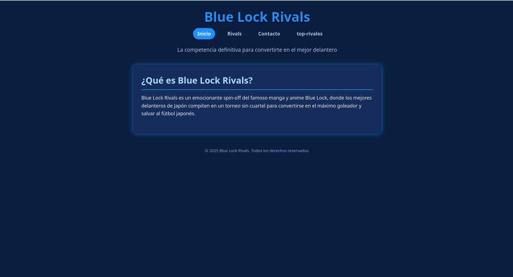
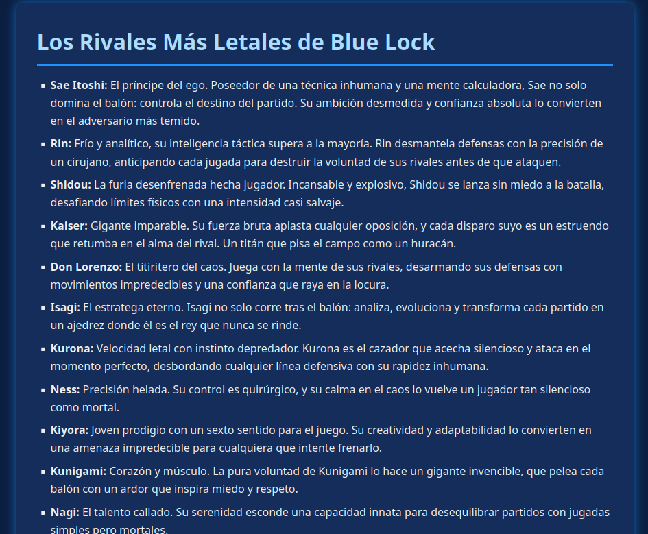
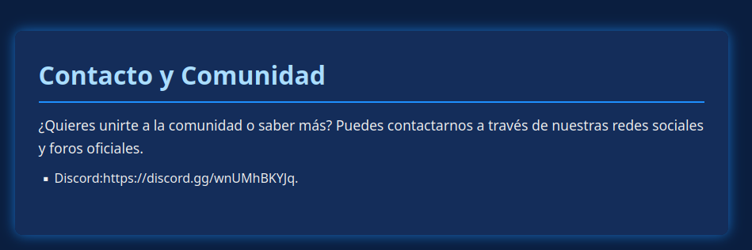
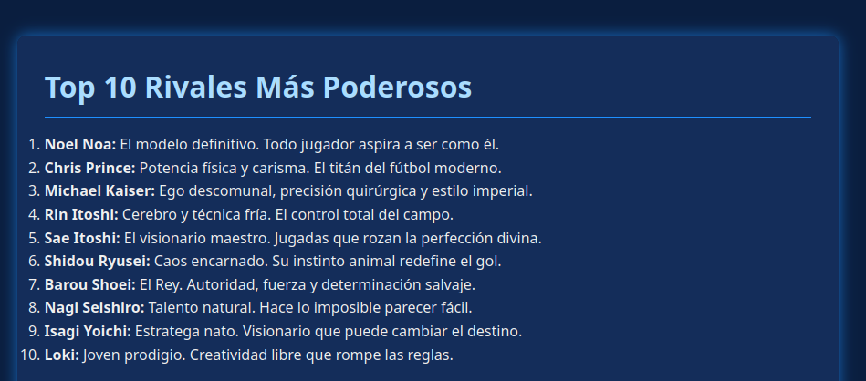

# descripcion de la pagina web

Blue Lock Rivals

Una pagina web sobre el universo de Blue Lock donde puedes conocer a los rivales más letales del fútbol japonés.

Qué es esto

Básicamente es una página web que hice porque soy fan de Blue Lock. Aquí puedes encontrar información sobre los jugadores más geniales de la serie, desde Sae Itoshi hasta Noel Noa.
Me inspiré viendo el anime y leyendo el manga, y pensé "sería genial tener toda esta info en un solo lugar", así que aquí estamos.

Lo que encontrarás

La página tiene varias secciones:
Inicio:Una explicación rápida de qué va todo esto. Es como una introducción para quien no sepa nada del tema.

Rivals: Aquí está la carne del asunto. Perfiles de cada jugador con sus habilidades, personalidades y por qué son tan peligrosos en el campo. Desde el cerebro frío de Rin hasta la locura de Shidou.

Top 10: Una lista que armé con los rivales más poderosos. Obviamente Noel Noa está en el #1 porque, vamos, es Noel Noa.

Contacto: Por si quieres unirte al Discord para hablar del tema con otros fans.

inicio

Blue Lock Rivals es donde los mejores delanteros de Japón se enfrentan en un torneo sin piedad para convertirse en el goleador definitivo y salvar al fútbol japonés.
No es solo un spin-off del manga - es la competencia más brutal donde solo sobrevive el más fuerte. Aquí cada jugador tiene su propia obsesión, su técnica letal y una mentalidad que roza la locura.
La pregunta no es si puedes ganar, sino si puedes mantener tu cordura mientras lo intentas.

Los Rivals 

Los "rivals" son esos jugadores que te hacen sudar frío solo de verlos en el campo. No son oponentes cualquiera - cada uno tiene algo especial que los hace únicos y peligrosos.
En Blue Lock no basta con ser bueno, tienes que ser el mejor. Y para eso necesitas enfrentarte a gente que te haga evolucionar o te destruya en el intento.
Cada rival tiene su propia "arma": Sae con su control absoluto, Rin con su análisis frío, Shidou con su caos creativo. Son los que hacen que el protagonismo se sienta ganado, no regalado.

conctacto

¿Quieres hablar de Blue Lock con otros fans? ¿Tienes teorías locas sobre quién es realmente el mejor rival? ¿O simplemente quieres discutir por qué Sae es superior a Rin?
Únete a nuestra comunidad en Discord donde debatimos, compartimos memes y analizamos cada jugada como si fuéramos entrenadores profesionales.

top

aqui hay un top 10 mejores jugadores de blue lock son selecionado por el comic y la wikipedia

